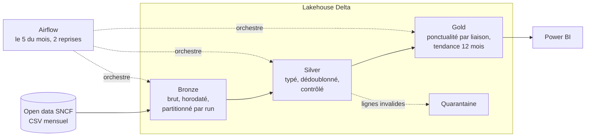

# Lakehouse Pipeline Demo

Pipeline de données de bout en bout sur données ouvertes : **Airflow** orchestre des jobs **Spark** qui construisent un lakehouse **Delta** en trois couches (bronze, silver, gold), jusqu'à des indicateurs prêts pour **Power BI**.

Cas d'usage : la ponctualité mensuelle des TGV par liaison, publiée par la SNCF et l'AQST sur [ressources.data.sncf.com](https://ressources.data.sncf.com/explore/dataset/regularite-mensuelle-tgv-aqst/).

## Architecture



| Couche | Job | Ce qu'il garantit |
|---|---|---|
| Bronze | `jobs/bronze_ingest.py` | Copie fidèle de la source, rejouable (Delta `replaceWhere` par date d'exécution) |
| Silver | `jobs/silver_clean.py` | Schéma stable, types corrects, doublons supprimés, lignes invalides isolées en quarantaine |
| Gold | `jobs/gold_kpis.py` | Taux de ponctualité, taux d'annulation, moyenne glissante 12 mois, top 10 des liaisons les moins ponctuelles |

## Choix d'ingénierie

- **Échouer bruyamment si la source change** : `rename_map` lève une erreur explicite si une colonne attendue disparaît, au lieu de produire des indicateurs faux.
- **Quarantaine plutôt que suppression** : une ligne rejetée reste consultable pour analyse.
- **Idempotence** : relancer un mois réécrit uniquement sa partition bronze.
- **Logique métier testable sans Spark** : les règles (`jobs/common.py`) sont en pur Python et couvertes par des tests.

## Lancer

```bash
pip install -r requirements.txt
pytest -q                                   # tests de la logique métier

# exécution locale, sans Airflow
export LAKE=./lake
spark-submit --packages io.delta:delta-spark_2.12:3.2.0 \
  --conf spark.sql.extensions=io.delta.sql.DeltaSparkSessionExtension \
  --conf spark.sql.catalog.spark_catalog=org.apache.spark.sql.delta.catalog.DeltaCatalog \
  --py-files jobs/common.py jobs/bronze_ingest.py --lake $LAKE --run-date 2026-09-30
# puis silver_clean.py et gold_kpis.py avec les mêmes options
```

Avec Airflow, copier `dags/` et `jobs/` dans votre déploiement et déclarer une connexion `spark_default`. Le même code tourne sur **Databricks** en remplaçant `SparkSubmitOperator` par `DatabricksSubmitRunOperator`.

---
Zakaria Khchiche · Tech Lead Data & IA · [Malt](https://www.malt.fr/profile/zakariakhchiche) · [LinkedIn](https://www.linkedin.com/in/zakariakhchiche)
